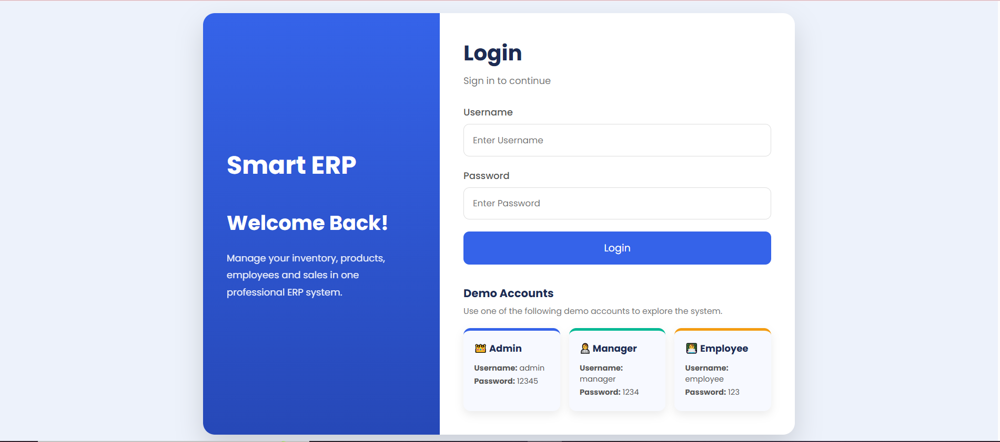
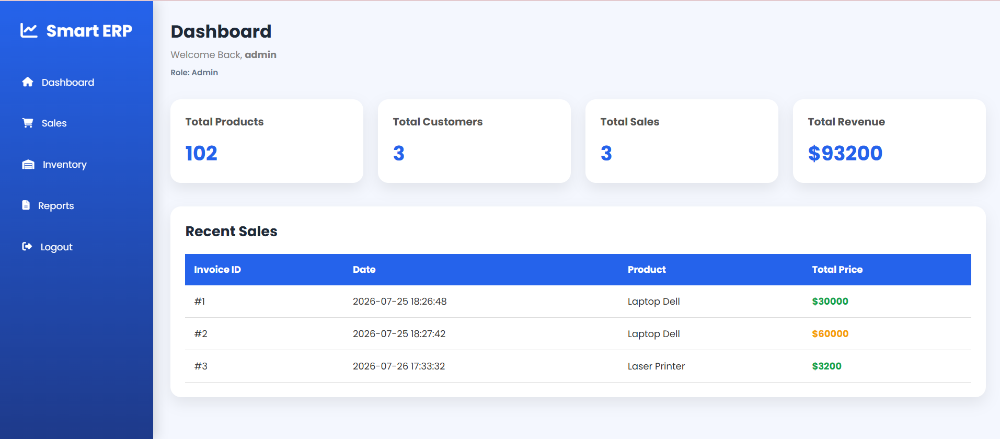
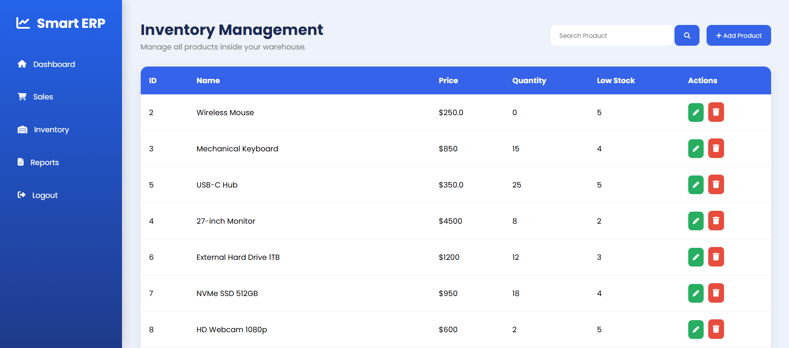
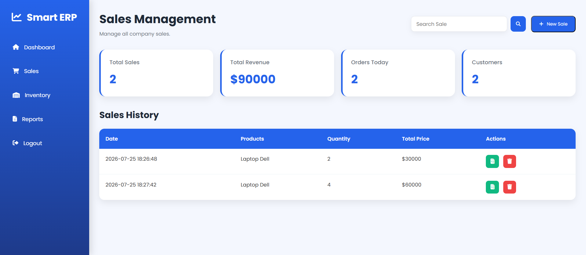
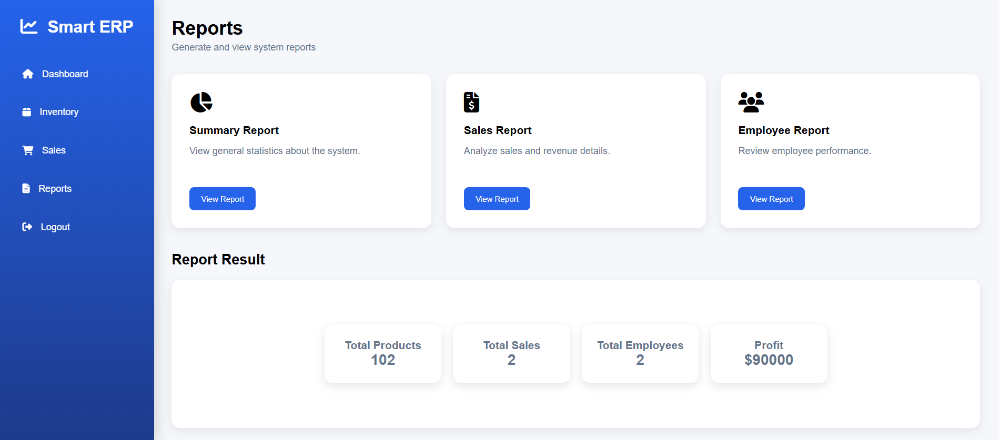

# Smart ERP System

A professional ERP (Enterprise Resource Planning) web application built using Flask.

## Features

- User Authentication
- Dashboard
- Inventory Management
- Sales Management
- Invoice Generation
- Reports
- Role-Based Access Control

## User Roles

### Admin

- Manage Products
- View Dashboard
- View Reports

### Manager

- Everything in Admin
- Add Users
- Manage Employees

### Employee

- Search Products
- Create Sales

## Technologies

- Python
- Flask
- HTML5
- CSS3
- JavaScript
- JSON

## Screenshots

## Login



## Dashboard



## Inventory



## Sales



## Reports



## Installation

```bash
git clone https://github.com/menna268/Smart-ERP-System.git

cd Smart-ERP-System

pip install -r requirements.txt

python Smart_ERP//app.py
```

## Author

- Menna Allah Hamada
- Heba Gaber
- Abdelrahman Hamdy
- Marvy Adel
- Marina Romany